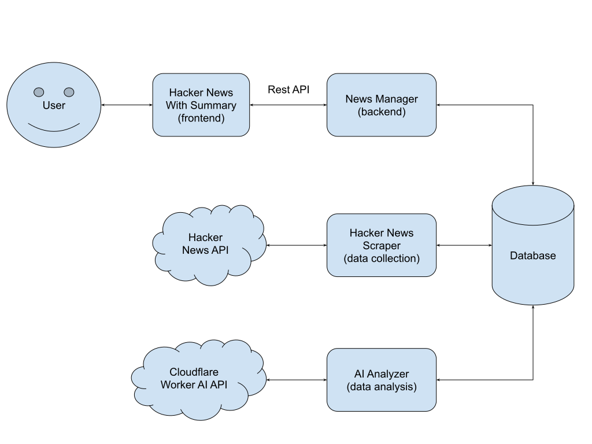

# HN Digest

HN Digest: AI-Powered Hacker News Summarizer.

Check it out 👉 [https://hacker-news-summary.pages.dev/](https://hacker-news-summary.pages.dev/)

## Description

**HN Digest** is an AI-powered application designed to summarize articles from Hacker News. The system leverages advanced natural language processing (NLP) to generate concise summaries and insights. The goal is to make it easier for users to stay informed about the latest discussions in technology, startups, and programming without having to sift through lengthy articles.

## Architecture

The architecture of HN Digest consists of several key components:

**Data Ingestion**:

- **Web Scraper**: Collects the latest articles from Hacker News.

**Data Processing**:

- **NLP Summarizer**: Uses a CloudFlare's Worker AI model to generate summaries of the articles.

**Storage**:

- **SQLite**: Stores article summaries and metadata.

**Backend Services**:

- **API Gateway**: Manages API requests and responses.
- **Cron Jobs**: Crawl news content regularly to summarize.

**Web Interface**:

- **CloudFlare pages**: Allows users to browse summaries, set preferences, and access additional details.

**Testing and Monitoring**:

- **Automated Testing**: Use GitHub action to run test automatically, ensures the functionality and performance of the application.
- **Monitoring Tools**: Use CloudFlare's monitor to track system performance and user engagement.

## System Requirements and Testability

**Functional Requirements**:

- **Summarization Accuracy**: The system should generate concise and accurate summaries of Hacker News articles.

**Non-Functional Requirements**:

- **Scalability**: The system should handle increasing amounts of data and users efficiently.
- **Performance**: The system should deliver summaries quickly and handle high traffic smoothly.
- **Reliability**: The system should be robust and available with minimal downtime.
- **Usability**: The user interface should be intuitive and easy to navigate.

**Testability**:

- **Unit Testing**: Each component (e.g., web scraper, summarizer) can be tested independently to ensure it meets its functional requirements.
- **Integration Testing**: Ensures that the components work together seamlessly and data flows correctly through the system.

## Source Code and Hosting

- **Source Code**: The source code for HN Digest is available in the GitHub repository at [https://github.com/BaffinLee/Hacker-News-Summary](https://github.com/BaffinLee/Hacker-News-Summary).
- **Hosted Application**: The live application can be accessed at [https://hacker-news-summary.pages.dev/](https://hacker-news-summary.pages.dev/).
